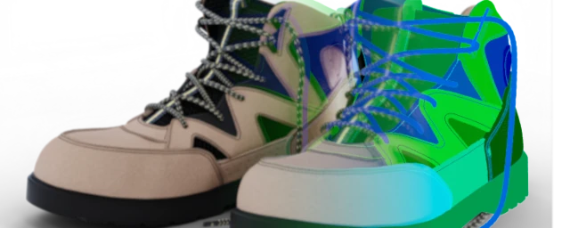

# Decryptomatte

This package works with Cryptomatte images, extracting and manipulating individual layers and their coverage information. It incorporates elements from the original `cryptomatte_arnold` unit tests, licensed under BSD-3 [https://github.com/Psyop/CryptomatteArnold](https://github.com/Psyop/CryptomatteArnold).


[Artwork by dj3dim](https://blendswap.com/blend/26178)

---

## Installation

### Install via pip
While you can install this package from PyPi via pip
`pip install decryptomatte`
You'll most likely miss the required binary OpenImageIO wheel for your platform.

### Install in virtual environment
On Windows, you can however clone this repository and install a binary OpenImageIO wheel from my private package index:
1. Get [Python](https://python.org) version > 3.9, tested with 3.11
2. `git clone https://github.com/tappi287/decryptomatte.git`
3. Install [poetry](https://python-poetry.org/docs/main/#installation)
4. Navigate to the repository directory `cd decryptomatte`
5. Run `poetry install`

You should now be able to import and use this package inside your poetry/virtual environment.

### Build and install OpenImageIO Dependency
If you don't want to use the provided OpenImageIO python wheels or want to use this 
on another OS or Python Version. 
You can build your own OpenImageIO Python bindings with [vcpkg](https://vcpkg.io/en/).
``` bash
vcpkg install openimageio[pybind11]:x64-windows
```
After a successful install you should add these paths from your vcpkg dir to your Python path:
`vcpkg/packages/openimageio_[platform]/lib/python[version]/site-packages/`
`vcpkg/installed/[platform]/bin`

You should now be able to do `import OpenImageIO` inside Python.

*Note*:
Vcpkg will use your default system Python Interpreter. If you have multiple versions installed, 
make sure you only leave the one active you want to compile for. Binary Python dependencies 
are bound to a minor version. E.g. building for 3.11 will only work with Python 3.11.x versions
and not for 3.10.x.

---

## Decryptomatte Example

The package contains a convenience script to extract all masks to individual image files. Usage is show below.
``` python
from pathlib import Path

from decryptomatte import cryptomatte_to_images

if __name__ == '__main__':
    input_dir = Path('test/data/input')
    output_dir = input_dir / 'out'
    
    sample_matte_img = input_dir / 'BlenderExample.exr'
    sample_beauty_img = input_dir / 'BlenderExample.exr'

    cryptomatte_to_images(sample_matte_img, sample_beauty_img, output_dir=output_dir)
```

## Usage

**Importing the Class:**

```python
from decryptomatte import Decrypt
```

**Creating an Instance:**

* **Basic Instance:**

```python
my_object = Decrypt("path/to/your/cryptomatte_image.exr")
```

* **Instance with Arguments:**

```python
my_object = Decrypt("path/to/your/cryptomatte_image.exr", alpha_over_compositing=True)
```

#### Alpha Over Compositing
`alpha_over_compositing` (optional, default `False`) specifies handling alpha over compositing during certain operations.
See the difference between working with it disabled(left) or enabled(right) in the following example image:

This is not need for proper compositing apps like Nuke or Fusion. But is needed for antique Editors like Photoshop.

**Accessing Attributes:**

While the class defines internal attributes, use the provided methods to interact with the object.

**Methods:**

* **`list_layers()`:** Returns available Cryptomatte layer names (IDs).
* **`sorted_crypto_metadata()`:** Returns sorted Cryptomatte metadata.
* **`get_cryptomatte_channels()`:** Returns a NumPy array containing all Cryptomatte image channels.
* **`get_mattes_by_names(layer_names: List[str]) -> Dict[float, np.ndarray]`:** Retrieves coverage mattes for specified layer names (IDs).
* **`get_masks_for_ids(target_ids: List[float]) -> Generator[Tuple[float, np.ndarray], None, None]`:** (internal) Generates individual masks (anti-aliased) for each object ID.
* **`get_mask_for_id(float_id: float, channels_arr: np.ndarray, level: int = 6, as_8bit=False) -> np.ndarray`:** (internal) Extracts the mask for a specific ID from Cryptomatte layers.
* **`id_to_name(self, id_float: float) -> str`:** Returns the human-readable layer name for the provided ID.
* **`create_layer_object_name(self, id_float: float) -> str`:** Creates a human-readable name combining the layer, ID, and object name.
* **`merge_matte_and_id_color(self, matte: np.ndarray, id_float: Optional[float] = None, layer_name: Optional[str] = None) -> np.ndarray`:** Creates an RGBA image by combining the provided matte with its corresponding ID color.
* **`merge_matte_and_rgb(matte: np.ndarray, rgb_img: np.ndarray = None) -> np.ndarray`:** (static) Merges a matte with an optional RGB image, creating an RGBA image.
* **`shutdown()`:** Releases OpenImageIO resources

## Example for creating layered Photoshop psd file
The tests contain an example to create a layered PSD file with [PhotoshopAPI](https://github.com/EmilDohne/PhotoshopAPI)
in [tests/test_decrypt_to_psd.py](tests/test_decrypt_to_psd.py)
To try you could simply add `PhotoshopAPI = "^0.3.0"` to this poetry env and execute the test.